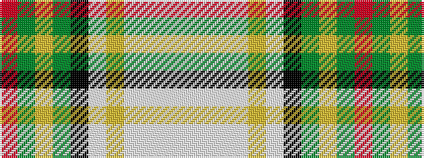

RGYGKWYWWWW

It is a 11 stripe tartan.

<figure class="pat-woven">

<figcaption>idealised sample</figcaption>
</figure>

## Colour Sequence



## Tartans with this colour sequence

| Tartans |
|---------------|
| [Unidentified (Tony Murray Collection](/variants/s11/r2dg20ly1dg1k2lb1ly1lb22w1lb1w1~x4/)|
||
