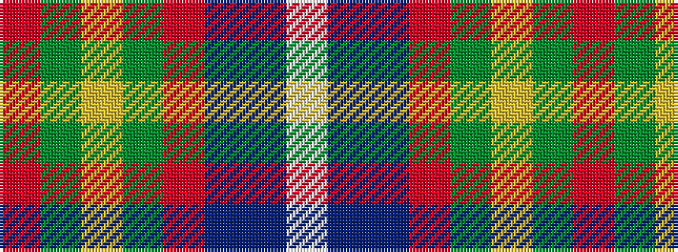

RGYGRBBW

It is a 8 stripe tartan.

<figure class="pat-woven">

<figcaption>idealised sample</figcaption>
</figure>

## Colour Sequence



## Tartans with this colour sequence

| Tartans |
|---------------|
| [Stewart of Fingask - 1745 (Clan?)](/setts/s8/r72g3ly2g26r14db6t6w2/)|
||
| [Stuart/Stewart of Fingask](/setts/s8/r72dg3ly2dg26r14db6t6w2/)|
||
