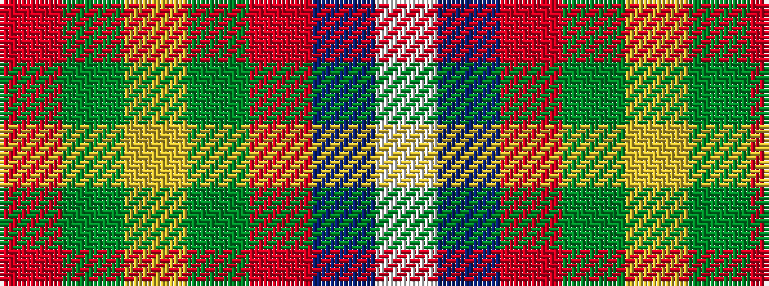

RGYGRBW

It is a 7 stripe tartan.

<figure class="pat-woven">

<figcaption>idealised sample</figcaption>
</figure>

## Colour Sequence



## Tartans with this colour sequence

| Tartans |
|---------------|
| [Bressuire (District)](/setts/s7/r1g4lo1g3r4n15w1~x4/)|
||
