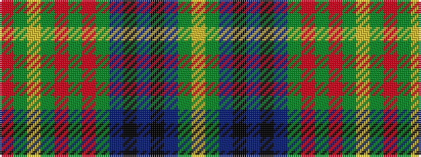

RGYGRGRGBKBKBGY

It is a 15 stripe tartan.

<figure class="pat-woven">

<figcaption>idealised sample</figcaption>
</figure>

## Colour Sequence



## Tartans with this colour sequence

| Tartans |
|---------------|
| [Holmes (Clan)](/setts/s15/ly4g39db9k3db5k3db9g32r2g3r2g5ly2g3r3~x2/)|
||
| [Kennedy #2](/setts/s15/ly8dg77db18k7db9k6db18dg64r4dg5r4dg9ly4dg5r6/)|
||
