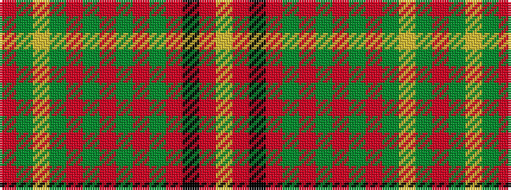

RGYGRGRGRGRKRY

It is a 14 stripe tartan.

<figure class="pat-woven">

<figcaption>idealised sample</figcaption>
</figure>

## Colour Sequence



## Tartans with this colour sequence

| Tartans |
|---------------|
| [Hay](/setts/s14/r6dg4ly2dg36r2dg2r2dg12r48dg4r2k1r2lr6~x2/)|
||
