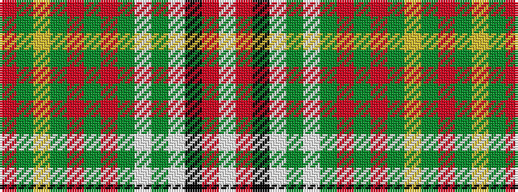

RGYGRGRGWGWKRW

It is a 14 stripe tartan.

<figure class="pat-woven">

<figcaption>idealised sample</figcaption>
</figure>

## Colour Sequence



## Tartans with this colour sequence

| Tartans |
|---------------|
| [Hay, White Dress](/setts/s14/r6g4ly4g25r4g6r4g6w34g4w4k4r4w6/)|
||
