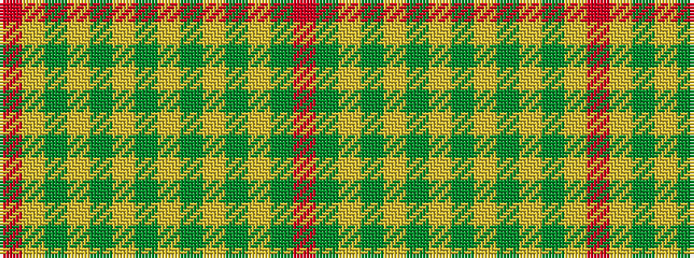

RGYGYGYGYGYGYR

It is a 14 stripe tartan.

<figure class="pat-woven">

<figcaption>idealised sample</figcaption>
</figure>

## Colour Sequence



## Tartans with this colour sequence

| Tartans |
|---------------|
| [Antigua & Barbuda](/setts/s14/r30g3lo3g3lo3g3lo3g3lo3g3lo3g3lo10r5~x2/)|
||
