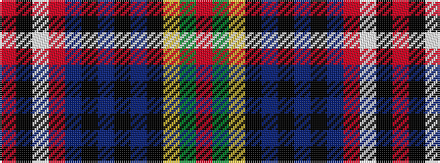

RGYKBKBKBRWKR

It is a 13 stripe tartan.

<figure class="pat-woven">

<figcaption>idealised sample</figcaption>
</figure>

## Colour Sequence



## Tartans with this colour sequence

| Tartans |
|---------------|
| [MacKintosh, MacPherson](/variants/s13/r36g8ly1k6t4k1t1k1t4r11w1k1r1~x2/)|
||
| [MacKintosh/MacPherson](/variants/s13/r36dg8ly1k6t4k1t1k1t4r11w1k1r1~x2/)|
||
