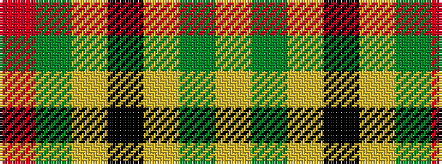

RGYKYGY

It is a 7 stripe tartan.

<figure class="pat-woven">

<figcaption>idealised sample</figcaption>
</figure>

## Colour Sequence



## Tartans with this colour sequence

| Tartans |
|---------------|
| [Harmer](/variants/s7/ly9dg4ly22k9ly9dg36r4~x2/)|
||
| [Harmer (Corporate)](/variants/s7/lo12dg4lo24k9lo8dg36r4/)|
||
