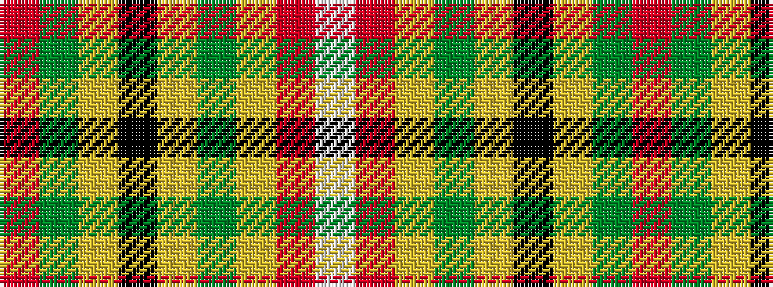

RGYKYGYRW

It is a 9 stripe tartan.

<figure class="pat-woven">

<figcaption>idealised sample</figcaption>
</figure>

## Colour Sequence



## Tartans with this colour sequence

| Tartans |
|---------------|
| [Prince Charles Edward](/setts/s9/r12g3ly4k2ly4g12ly2r3w1~x4/)|
||
