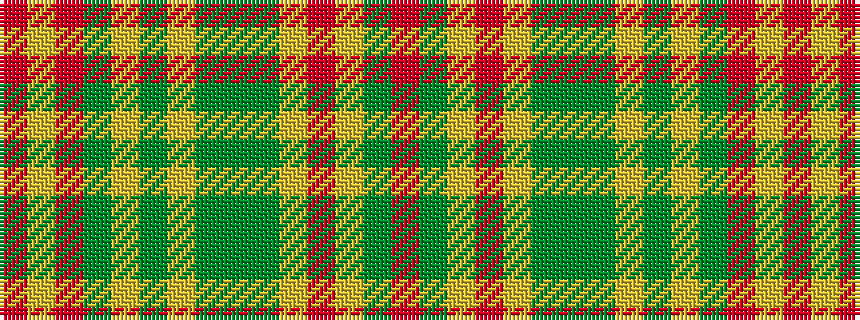

RGYRYGGGYGYGRYR

It is a 15 stripe tartan.

<figure class="pat-woven">

<figcaption>idealised sample</figcaption>
</figure>

## Colour Sequence



## Tartans with this colour sequence

| Tartans |
|---------------|
| [MacPherson #9](/setts/s15/r13lr4r13dg28lr3dyi26lr10dyi2dy2dyi2lr10r14lr4dyi4r4~x2/)|
||
