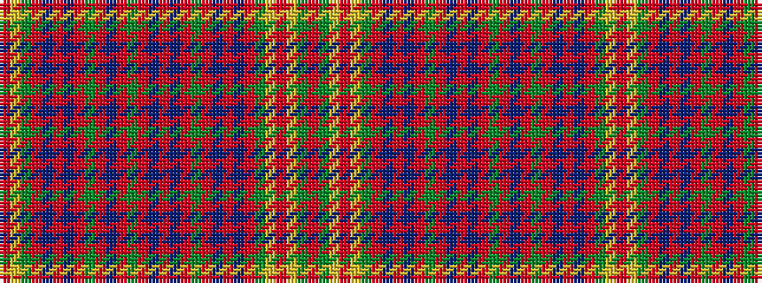

RGYRYGRBRBRGRBRBRGRBRGRBRBRGYR

It is a 30 stripe tartan.

<figure class="pat-woven">

<figcaption>idealised sample</figcaption>
</figure>

## Colour Sequence



## Tartans with this colour sequence

| Tartans |
|---------------|
| [MacAlister](/variants/s30/r12g3ly1r2ly1g3r3db3r6t1r1g8r1t1r12t1r1g8r1t1r6g2r1t1r2t1r1g3ly1r4~x4/)|
||
| [MacAlister (Gourlay Steele Collection)](/variants/s30/r12dg3ly1r2ly1dg3r3db3r6t1r1dg8r1t1r12t1r1dg8r1t1r6dg2r1t1r2t1r1dg3ly1r4~x4/)|
||
