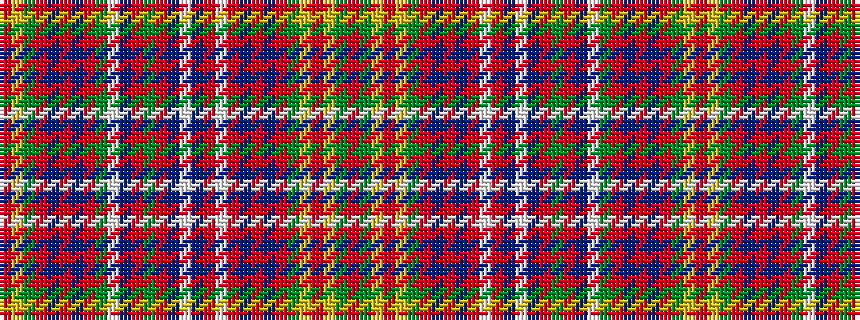

RGYRYGRBRBRWRBWBRGRBWGRBRBRGYR

It is a 30 stripe tartan.

<figure class="pat-woven">

<figcaption>idealised sample</figcaption>
</figure>

## Colour Sequence



## Tartans with this colour sequence

| Tartans |
|---------------|
| [MacAlister Dress](/setts/s30/r12g3ly1r2ly1g3r3db3r6t1r1w8r1t1w12t1r1g8r1t1w6g2r1t1r2t1r1g3ly1r4~x4/)|
||
