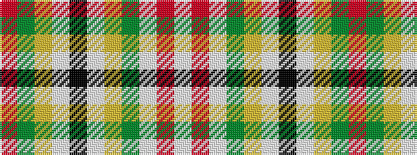

RGYWKWYGWRW

It is a 11 stripe tartan.

<figure class="pat-woven">

<figcaption>idealised sample</figcaption>
</figure>

## Colour Sequence



## Tartans with this colour sequence

| Tartans |
|---------------|
| [Unnamed C18th - Pr Ch Ed Plaid?](/variants/s11/r10dg3ly3w1k2w1ly3dg12w2r3w1~x4/)|
||
