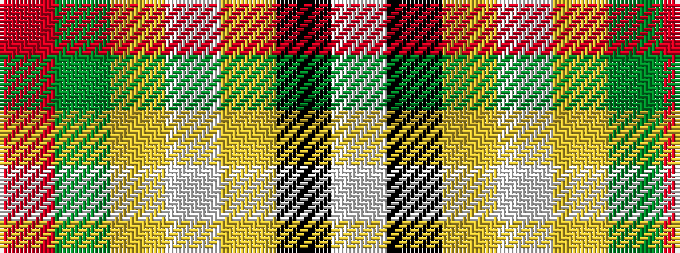

RGYWYKW

It is a 7 stripe tartan.

<figure class="pat-woven">

<figcaption>idealised sample</figcaption>
</figure>

## Colour Sequence



## Tartans with this colour sequence

| Tartans |
|---------------|
| [Avalon](/setts/s7/r5g3ly6w3ly5k55w5~x2/)|
||
