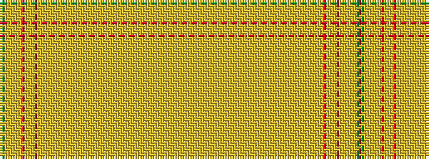

RGYYYYYYYRYYYYRYYYYYYYYYYYYYYYYYYYYYYYYYYYYYYYYYYYYYYYYYYYYYYYYYYYYYYYYYY

It is a 73 stripe tartan.

<figure class="pat-woven">

<figcaption>idealised sample</figcaption>
</figure>

## Colour Sequence



## Tartans with this colour sequence

| Tartans |
|---------------|
| [Unidentified (2013)](/variants/s73/r5dg10lo1loi1lo1loi1lo1loi1lo1r9lo1lo1loi1lo1r7lo1loi1lo1loi1lo1loi1lo1loi1lo1loi1lo1loi1lo1loi1lo1loi1lo1loi1lo1loi1lo1loi1lo1loi1lo1loi1lo1loi1lo1loi1lo1loi1lo1loi1lo1loi1lo1loi1lo1loi1lo1loi1lo1loi-he05c3499df3d94e1/)|
||
