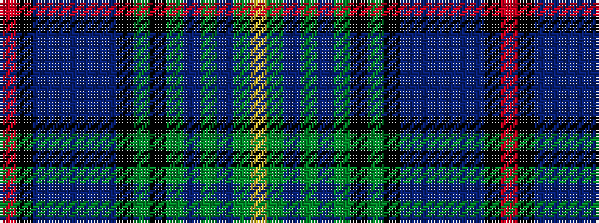

RKBBBBBKGKGBGBGY

It is a 16 stripe tartan.

<figure class="pat-woven">

<figcaption>idealised sample</figcaption>
</figure>

## Colour Sequence



## Tartans with this colour sequence

| Tartans |
|---------------|
| [MacWatts (Personal)](/variants/s16/ly4g7dp2g2dp12g2k2g1k12dbi2db12dbi2db2dbi7k2r3~x2/)|
||
