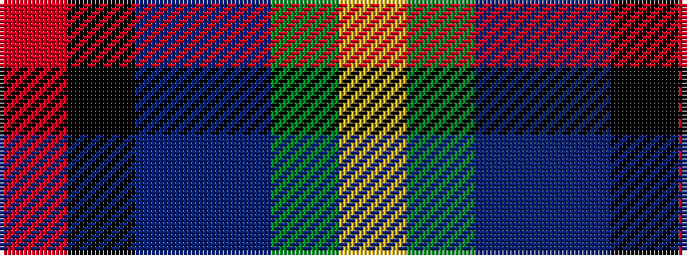

RKBBGY

It is a 6 stripe tartan.

<figure class="pat-woven">

<figcaption>idealised sample</figcaption>
</figure>

## Colour Sequence



## Tartans with this colour sequence

| Tartans |
|---------------|
| [Gallowater](/variants/s6/r10k18t10db18g40ly5/)|
||
| [Gallowater, Original](/variants/s6/r10k17t10dp17g40ly10~x2/)|
||
