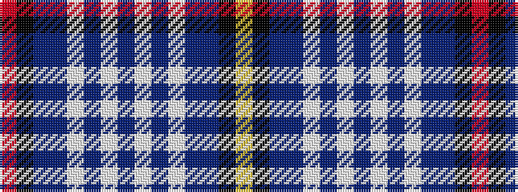

RKBBWBWBWBWBBKY

It is a 15 stripe tartan.

<figure class="pat-woven">

<figcaption>idealised sample</figcaption>
</figure>

## Colour Sequence



## Tartans with this colour sequence

| Tartans |
|---------------|
| [Citadel Military Academy Regimental Tartan Tartan Number: 1572. Earliest known date: 1980 Submitted to STS Monitoring Committee March 1982. South Carolina Military School. Ludovic Grant-Alexander possibly designer (Bob Marton) at that time, head of the Citadel Piping School. Woven by Dalgleish, 1980. Changed background to azure in 2007 following advice from C Adams. See products available Copyright © Blair Urquhart, Comrie, 2015](/setts/s15/r3k2t18db11w3db2w2db5w2db2w3db11t18k2ly3~x2/)|
||
| [Citadel, Military Academy](/setts/s15/r3k2db18dbi11w3dbi2w2dbi5w2dbi2w3dbi11db18k2ly3~x2/)|
||
