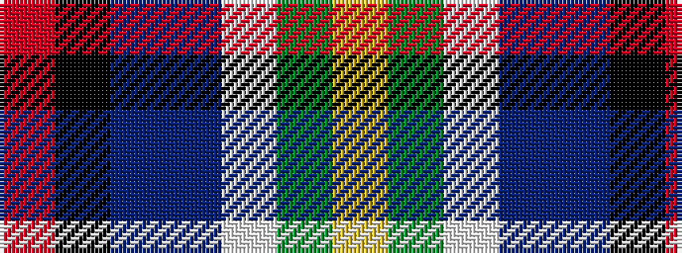

RKBBWGY

It is a 7 stripe tartan.

<figure class="pat-woven">

<figcaption>idealised sample</figcaption>
</figure>

## Colour Sequence



## Tartans with this colour sequence

| Tartans |
|---------------|
| [Gala Water New](/setts/s7/r5k16t7dp16w1dg21ly5~x2/)|
||
| [Gallowater New District Tartan Tartan Number: 1571. Earliest known date: 1819 The Gallowater district tartan, sometimes referred to as the 'Gala Water' was first mentioned in the records of Wilson's of Bannockburn in 1793. The design progressed until 1819 when this 'New' sett was recorded in the company's pattern book with a red band and a thin white stripe. See products available Copyright © Blair Urquhart, Comrie, 2015](/setts/s7/r5k16t7dp16w1g21ly5~x2/)|
||
| [Gallowater, New](/setts/s7/r5k16t7p16w1g21ly5~x2/)|
||
| [Gallowater, New (District)](/setts/s7/r11k33t14dp32w2g42ly10/)|
||
