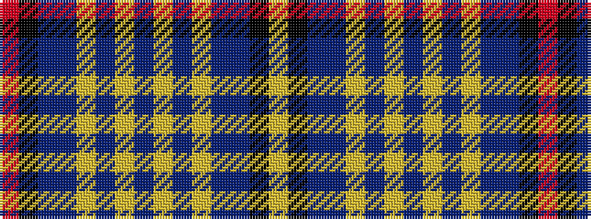

RKBBYBYBYBYBBKY

It is a 15 stripe tartan.

<figure class="pat-woven">

<figcaption>idealised sample</figcaption>
</figure>

## Colour Sequence



## Tartans with this colour sequence

| Tartans |
|---------------|
| [Citadel Military Academy](/variants/s15/r3k2t18db10lr3db2lr2db5lr2db2lr3db10t18k2ly3~x2/)|
||
