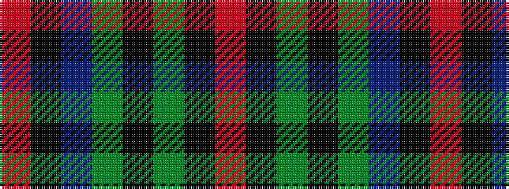

RKBGKGKR

It is a 8 stripe tartan.

<figure class="pat-woven">

<figcaption>idealised sample</figcaption>
</figure>

## Colour Sequence



## Tartans with this colour sequence

| Tartans |
|---------------|
| [McCarter (2016)](/setts/s8/o4k2dy15k2dg15db15k2r1~x2/)|
||
