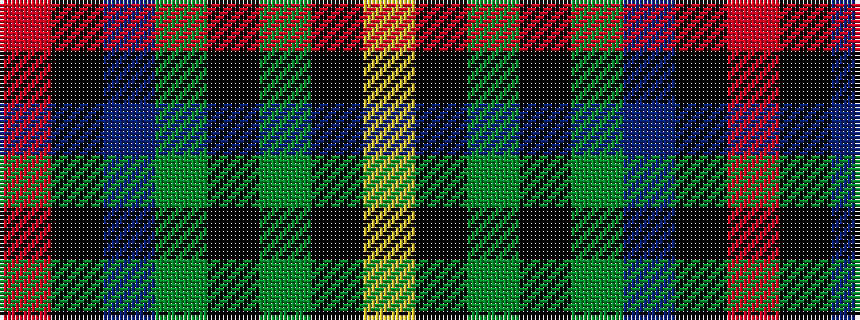

RKBGKGKY

It is a 8 stripe tartan.

<figure class="pat-woven">

<figcaption>idealised sample</figcaption>
</figure>

## Colour Sequence



## Tartans with this colour sequence

| Tartans |
|---------------|
| [Tait #1](/setts/s8/r5k2db19g4k19g28k2ly5~x2/)|
||
