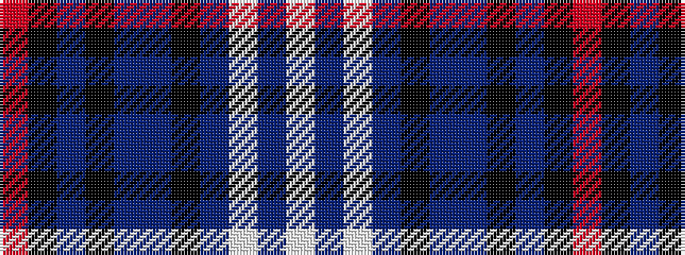

RKBKBBKBWBW

It is a 11 stripe tartan.

<figure class="pat-woven">

<figcaption>idealised sample</figcaption>
</figure>

## Colour Sequence



## Tartans with this colour sequence

| Tartans |
|---------------|
| [William Glen and Son](/setts/s11/r6k3n4k10n5t2k2n31w1n2w2~x2/)|
||
