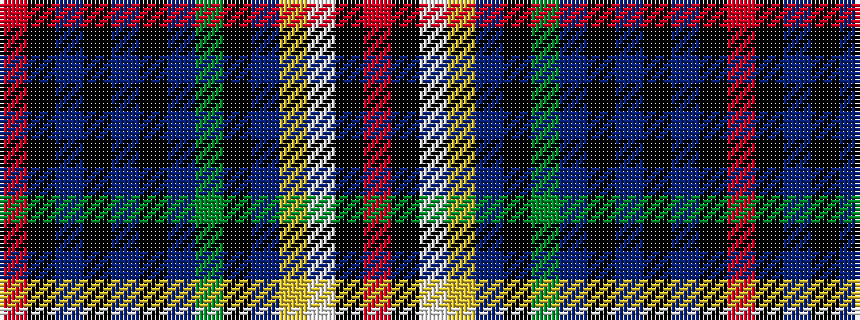

RKBKBKBGKBYWKR

It is a 14 stripe tartan.

<figure class="pat-woven">

<figcaption>idealised sample</figcaption>
</figure>

## Colour Sequence



## Tartans with this colour sequence

| Tartans |
|---------------|
| [Association Cornemuses du Monde](/variants/s14/r3k5w3ly2b10k1y19n19k28n3k3n3k3r3/)|
||
