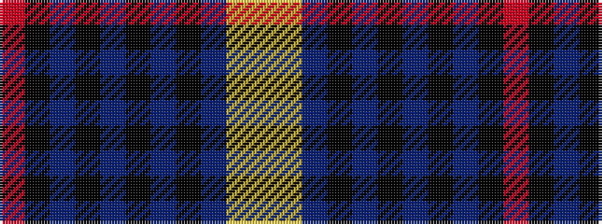

RKBKBKBKBYY

It is a 11 stripe tartan.

<figure class="pat-woven">

<figcaption>idealised sample</figcaption>
</figure>

## Colour Sequence



## Tartans with this colour sequence

| Tartans |
|---------------|
| [Bute Heather, Grey (Fashion)](/variants/s11/lri13lr2n38k13n8k8n17k2n17k4o11/)|
||
