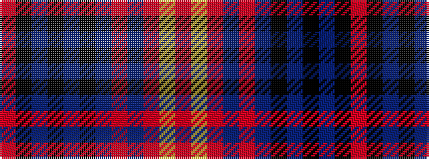

RKBKBKBRBRYR

It is a 12 stripe tartan.

<figure class="pat-woven">

<figcaption>idealised sample</figcaption>
</figure>

## Colour Sequence



## Tartans with this colour sequence

| Tartans |
|---------------|
| [Cailean #2 (Fashion)](/setts/s12/o4k12db2k2db2k2db2o16dr3o2lr2o4~x2/)|
||
