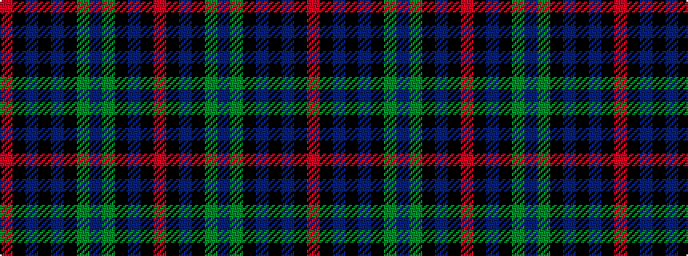

RKBKBKGBGKBKR

It is a 13 stripe tartan.

<figure class="pat-woven">

<figcaption>idealised sample</figcaption>
</figure>

## Colour Sequence



## Tartans with this colour sequence

| Tartans |
|---------------|
| [Metropolitan Atlanta Police (Corp)](/variants/s13/r2k2db21k8dg16db3dg16k8db3k3db21k2r2~x2/)|
||
