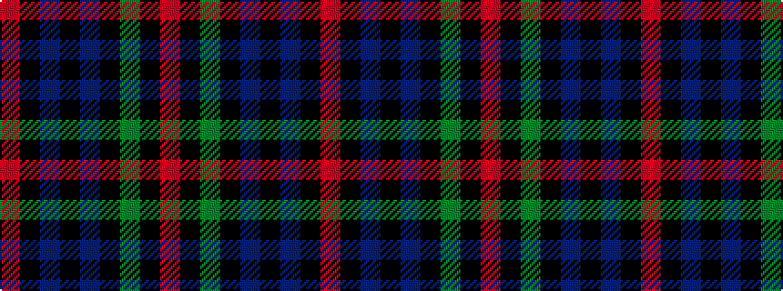

RKBKBKGKR

It is a 9 stripe tartan.

<figure class="pat-woven">

<figcaption>idealised sample</figcaption>
</figure>

## Colour Sequence



## Tartans with this colour sequence

| Tartans |
|---------------|
| [Klappert Original (Odsherred, Denmark) (Personal)](/variants/s9/r1k1dt30k6dt1k6dy8k1r1~x2/)|
||
| [Klappert Original (Personal)](/variants/s9/r1k1n30k6n1k6dy8k1r1~x2/)|
||
