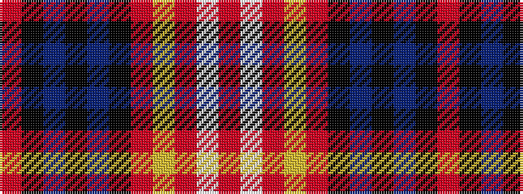

RKBKBKRYRWR

It is a 11 stripe tartan.

<figure class="pat-woven">

<figcaption>idealised sample</figcaption>
</figure>

## Colour Sequence



## Tartans with this colour sequence

| Tartans |
|---------------|
| [Scotland Forever Antique (Fashion)](/setts/s11/o6k3n19k6n4k3o12lr4o12w2o5~x2/)|
||
