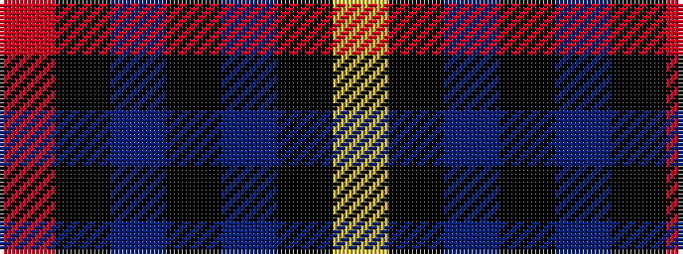

RKBKBKY

It is a 7 stripe tartan.

<figure class="pat-woven">

<figcaption>idealised sample</figcaption>
</figure>

## Colour Sequence



## Tartans with this colour sequence

| Tartans |
|---------------|
| [Graeme High School Homecoming 2009](/variants/s7/r1k1db10k1p4k9ly1~x4/)|
||
| [MacCrimmon from Skye](/variants/s7/r5k3t22k17t22k3ly5~x2/)|
||
