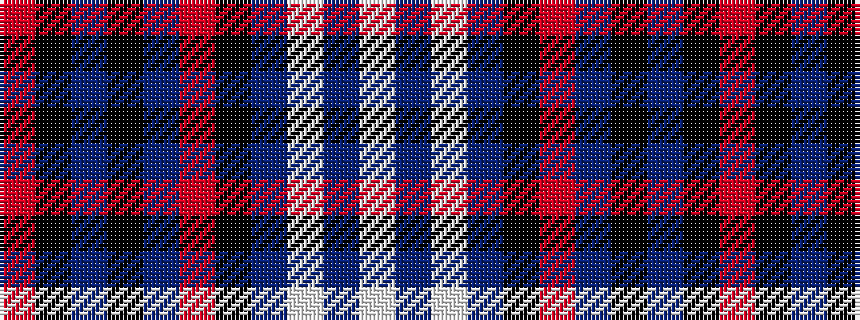

RKBKBRKBWBW

It is a 11 stripe tartan.

<figure class="pat-woven">

<figcaption>idealised sample</figcaption>
</figure>

## Colour Sequence



## Tartans with this colour sequence

| Tartans |
|---------------|
| [Glen and Son, William (Corporate)](/setts/s11/r6k3do4k10do5o3k2do31w1do2w2~x2/)|
||
