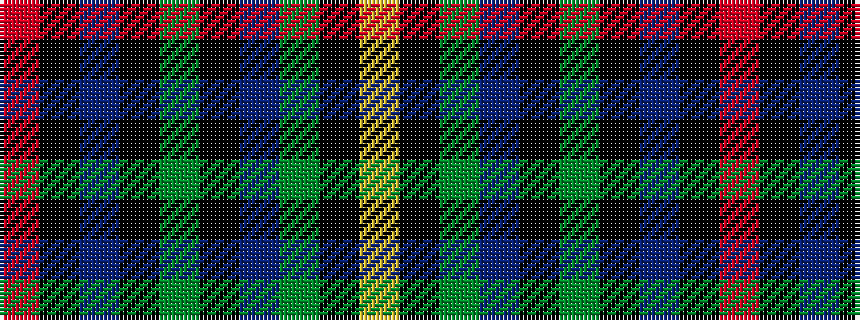

RKBKGKBGKY

It is a 10 stripe tartan.

<figure class="pat-woven">

<figcaption>idealised sample</figcaption>
</figure>

## Colour Sequence



## Tartans with this colour sequence

| Tartans |
|---------------|
| [Sullivan (Estimated threadcount)](/setts/s10/r3k1t10k1g2k1db8g12k1ly3~x2/)|
||
