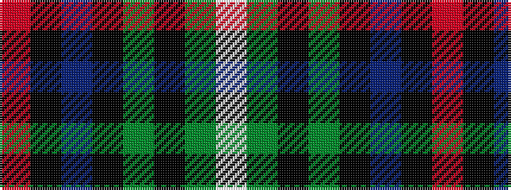

RKBKGKGW

It is a 8 stripe tartan.

<figure class="pat-woven">

<figcaption>idealised sample</figcaption>
</figure>

## Colour Sequence



## Tartans with this colour sequence

| Tartans |
|---------------|
| [Meiklejohn (Personal)](/variants/s8/m2k13db4k13dg6k17dg23w1~x2/)|
||
