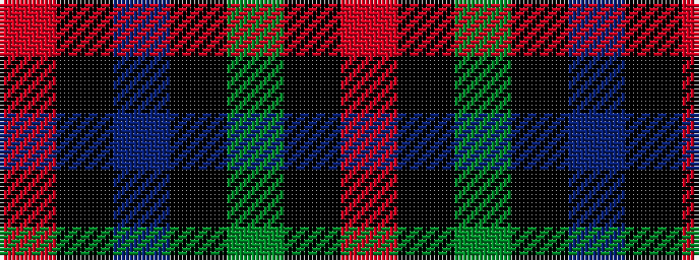

RKBKGKR

It is a 7 stripe tartan.

<figure class="pat-woven">

<figcaption>idealised sample</figcaption>
</figure>

## Colour Sequence



## Tartans with this colour sequence

| Tartans |
|---------------|
| [Black Watch (Coarse Kilt)](/setts/s7/r4k4db24k24g24k2r3~x2/)|
||
| [Coarse Kilt](/setts/s7/r3k2dg25k28db25k2r3~x2/)|
||
