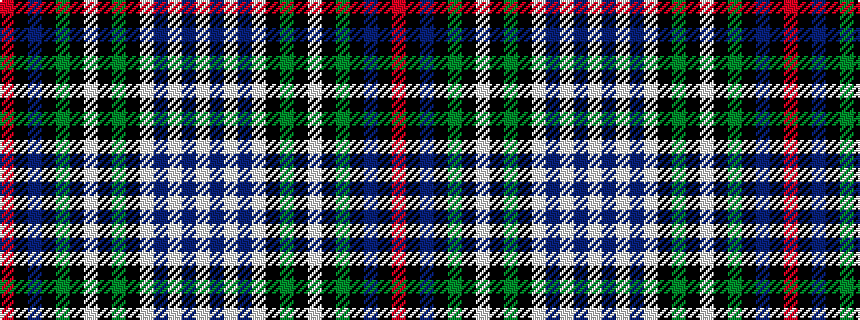

RKBKGKWKGKWBWBW

It is a 15 stripe tartan.

<figure class="pat-woven">

<figcaption>idealised sample</figcaption>
</figure>

## Colour Sequence



## Tartans with this colour sequence

| Tartans |
|---------------|
| [MacKenzie Dress #2](/variants/s15/w16db3w3db3w3k16dg13k1w3k1dg13k16db16k1r3~x2/)|
||
| [MacKenzie, dress](/variants/s15/w16db3w3db3w3k16g13k1w3k1g13k16db16k1r3~x2/)|
||
