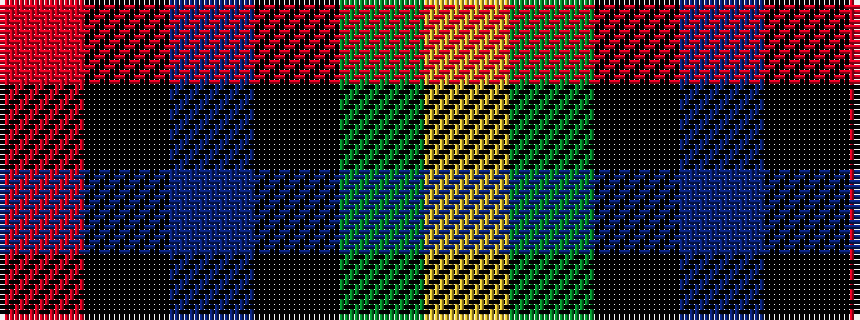

RKBKGY

It is a 6 stripe tartan.

<figure class="pat-woven">

<figcaption>idealised sample</figcaption>
</figure>

## Colour Sequence



## Tartans with this colour sequence

| Tartans |
|---------------|
| [Loudoun's Highlanders - 1747 #1 (Mil](/variants/s6/r4k2db24k20g20lo3~x2/)|
||
