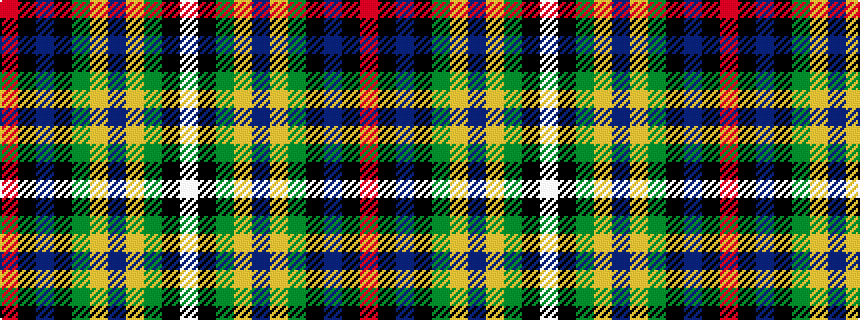

RKBKGYBYGKW

It is a 11 stripe tartan.

<figure class="pat-woven">

<figcaption>idealised sample</figcaption>
</figure>

## Colour Sequence



## Tartans with this colour sequence

| Tartans |
|---------------|
| [Hororata](/variants/s11/r2k1db30k6g12ly1db2ly1g12k3w1~x2/)|
||
