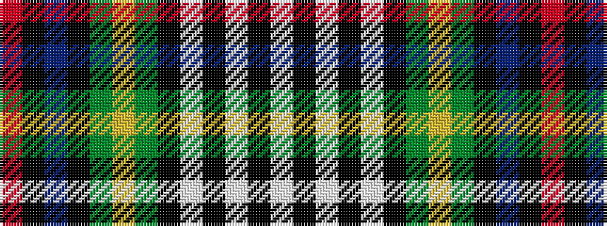

RKBKGYGKWKWKW

It is a 13 stripe tartan.

<figure class="pat-woven">

<figcaption>idealised sample</figcaption>
</figure>

## Colour Sequence



## Tartans with this colour sequence

| Tartans |
|---------------|
| [Farquharson Dress](/variants/s13/w6k1w1k1w1k8g8lo2g8k8db8k1r2~x2/)|
||
| [Farquharson Dress (Fashion)](/variants/s13/lb6k1lb1k1lb1k8g8lo2g8k8db8k1r2~x2/)|
||
