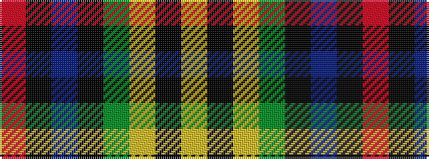

RKBKGYKY

It is a 8 stripe tartan.

<figure class="pat-woven">

<figcaption>idealised sample</figcaption>
</figure>

## Colour Sequence



## Tartans with this colour sequence

| Tartans |
|---------------|
| [Thomas of Craigie (Personal)](/setts/s8/ly2k4ly1dg16k14db23k4r1~x2/)|
||
| [Thomas, baron of Craigie, Robert (Personal)](/setts/s8/r2k4dt23k14dg16ly1k4ly2~x2/)|
||
