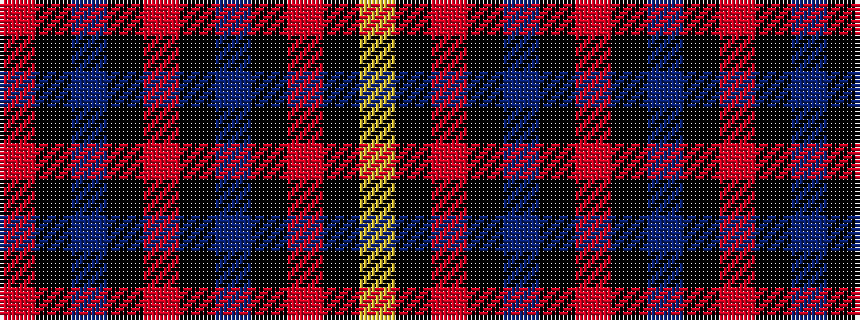

RKBKRKBKRKY

It is a 11 stripe tartan.

<figure class="pat-woven">

<figcaption>idealised sample</figcaption>
</figure>

## Colour Sequence



## Tartans with this colour sequence

| Tartans |
|---------------|
| [Brooks Brothers (Corporate)](/variants/s11/oi48k10db12k2oi3k2db12k10o10k2ly3~x2/)|
||
