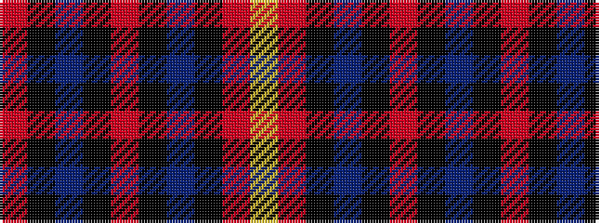

RKBKRKBKRY

It is a 10 stripe tartan.

<figure class="pat-woven">

<figcaption>idealised sample</figcaption>
</figure>

## Colour Sequence



## Tartans with this colour sequence

| Tartans |
|---------------|
| [Wcwm 1684](/variants/s10/r48k10dt12k2r3k2dt12k10r2ly3~x2/)|
||
