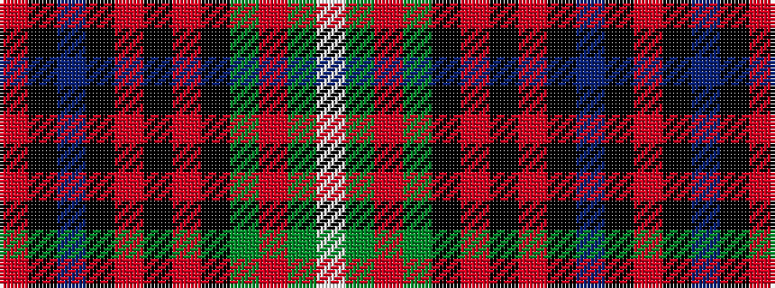

RKBKRKRKGRGW

It is a 12 stripe tartan.

<figure class="pat-woven">

<figcaption>idealised sample</figcaption>
</figure>

## Colour Sequence



## Tartans with this colour sequence

| Tartans |
|---------------|
| [Platinum Golf Scotland](/setts/s12/o2k3dp1k45o1k2o2k2dg4r1dg1w1~x2/)|
||
