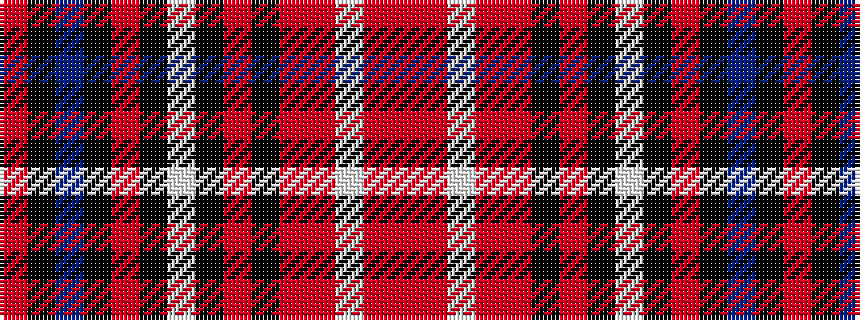

RKBKRKWKRKRRWRR

It is a 15 stripe tartan.

<figure class="pat-woven">

<figcaption>idealised sample</figcaption>
</figure>

## Colour Sequence



## Tartans with this colour sequence

| Tartans |
|---------------|
| [Dunkeld](/setts/s15/o4o3w24o4o4k12m16k2w4k2m16k12dr16k2o4/)|
||
