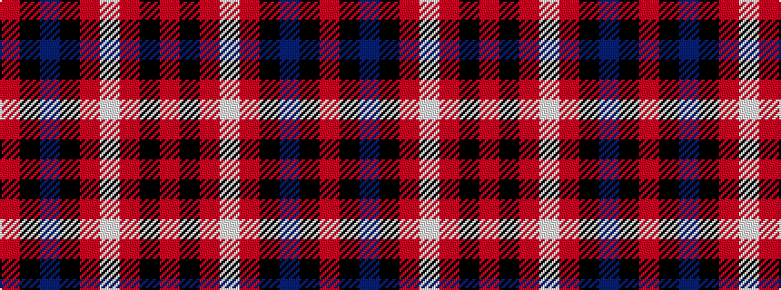

RKBKRWRKR

It is a 9 stripe tartan.

<figure class="pat-woven">

<figcaption>idealised sample</figcaption>
</figure>

## Colour Sequence



## Tartans with this colour sequence

| Tartans |
|---------------|
| [Heart of the Highlands](/variants/s9/o18k3o4lb3o4k18n20k2m4~x2/)|
||
