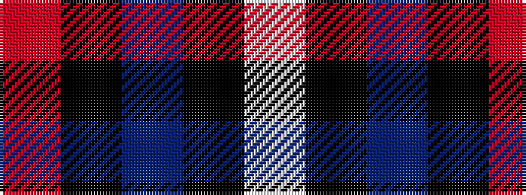

RKBKW

It is a 5 stripe tartan.

<figure class="pat-woven">

<figcaption>idealised sample</figcaption>
</figure>

## Colour Sequence



## Tartans with this colour sequence

| Tartans |
|---------------|
| [Bro-Spirit of Northmen (Corporate)](/variants/s5/r3k1b27k27w3~x2/)|
||
