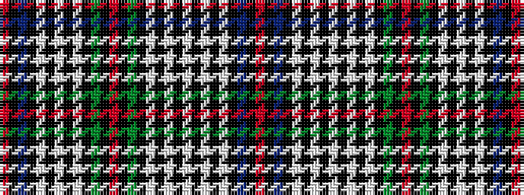

RKBKWKWKWKGKRKGKWKWKWKWKWKBKR

It is a 29 stripe tartan.

<figure class="pat-woven">

<figcaption>idealised sample</figcaption>
</figure>

## Colour Sequence



## Tartans with this colour sequence

| Tartans |
|---------------|
| [MacKinlay Dress](/setts/s29/r2k1db8k6lb8k2lb2k2lb8k6g8k1r2k1g8k6lb2k2lb2k2lb6k2lb2k2lb2k6db8k1r2~x2/)|
||
