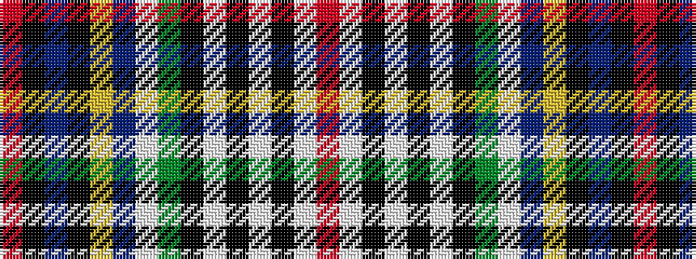

RKBKYBWGKWKWKWR

It is a 15 stripe tartan.

<figure class="pat-woven">

<figcaption>idealised sample</figcaption>
</figure>

## Colour Sequence



## Tartans with this colour sequence

| Tartans |
|---------------|
| [Webb (Personal)](/variants/s15/r6w2k3w2k3w2k3g16w2db6ly3k2db10k2r4~x2/)|
||
