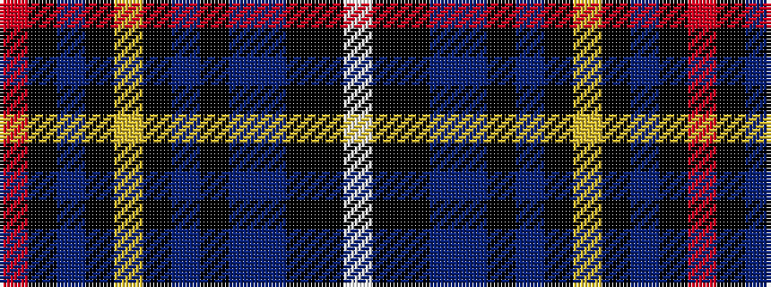

RKBKYKBKBBKKW

It is a 13 stripe tartan.

<figure class="pat-woven">

<figcaption>idealised sample</figcaption>
</figure>

## Colour Sequence



## Tartans with this colour sequence

| Tartans |
|---------------|
| [McFly School](/setts/s13/o28k4db6k2lo4k2db6k28db4db2k1k1lb2/)|
||
