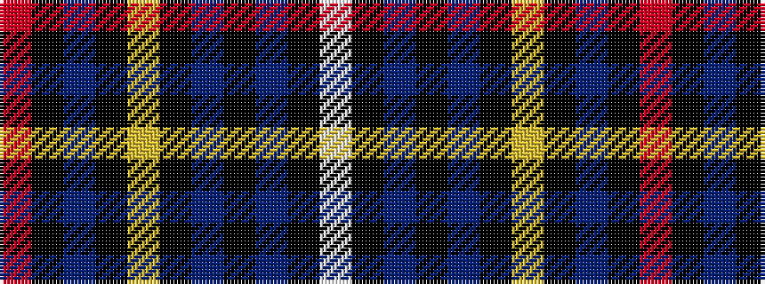

RKBKYKBKBKW

It is a 11 stripe tartan.

<figure class="pat-woven">

<figcaption>idealised sample</figcaption>
</figure>

## Colour Sequence



## Tartans with this colour sequence

| Tartans |
|---------------|
| [McGuffey (School)](/variants/s11/o14k2db3k1ly2k1db3k14db3k1w1~x2/)|
||
